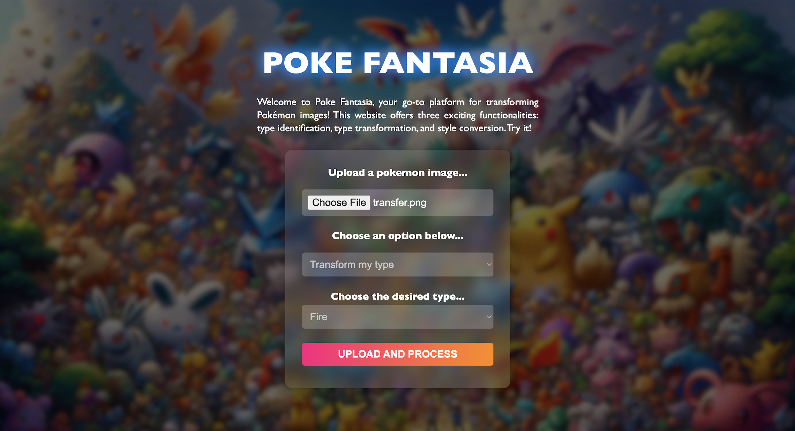
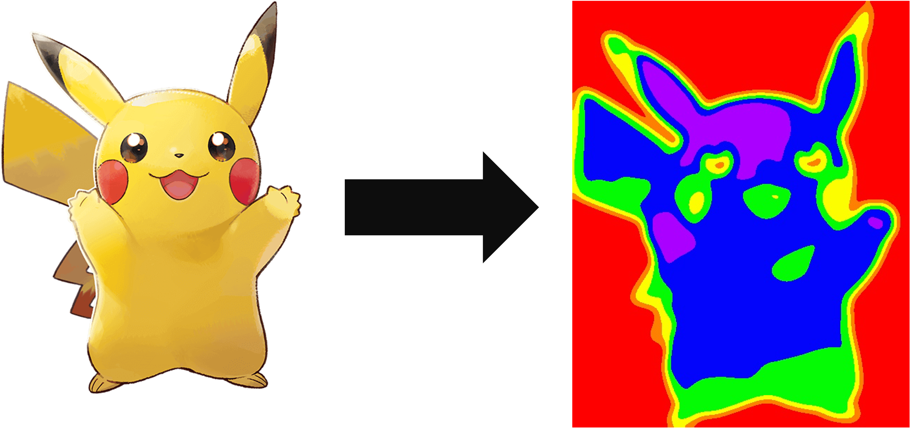

# Poke Fantasia 🌟

<br>
    
<br>

Welcome to **Poke Fantasia** – your ultimate online portal to the world of Pokémon! This interactive platform combines functionality, fun, and Pokémon nostalgia to create a seamless user experience.

## Features & Functionalities

1. **Pokemon Classification**

   - Upload a picture of any Pokémon, and the website will identify its type (e.g. Grass, Fire, Dragon) using advanced image classification algorithms.
   - This feature is perfect for trainers looking to quickly discover or confirm Pokémon types based on visuals.

2. **Pokemon Transformation**

    <br>

    

    <br>
    <br>
    <br>

   - Transform your Pokémon into any other type you want!
   - For example, turn a Water-type Pokémon into a Fire-type, or a Psychic-type into a Dragon-type, just for fun or creative exploration.
   - The transformed Pokémon's appearance will adjust to reflect the new type, offering a glimpse of imaginative type redesigns.

3. **Pokemon Image Style Transfer**

    <br>

    

    <br>
    <br>
    <br>

   - Upload an image of your Pokémon and apply a completely new artistic style to it.
   - Choose from styles like comic book, abstract art, watercolor, and more.
   - Watch as your Pokémon transforms into a stunning piece of artwork with the selected visual style, great for creating unique fan art or profile pictures!

## Project Structure

- **app.js**: Main entry point of the application.
- **assets/**: Contains static assets like images, CSS, and JavaScript.
- **config/**: Configuration files for the application.
- **public/**: Publicly accessible static files.
- **routes/**: API and page routing logic.
- **views/**: HTML templates for server-side rendering.

## Dependencies

The project relies on the following key dependencies (as defined in `package.json`):

- **@aws-sdk/client-s3**: ^3.705.0
- **@aws-sdk/lib-storage**: ^3.705.0
- **axios**: ^1.7.9
- **body-parser**: ^1.20.2
- **dotenv**: ^16.4.7
- **ejs**: ^3.1.9
- **express**: ^4.18.2
- **multer**: ^1.4.5-lts.1

## Setup Instructions

To run the project locally:

1. Clone the repository:

   ```bash
   git clone https://github.com/harryo583/poke-fantasia.git
   cd poke-fantasia
   ```

2. Install dependencies:

   ```bash
   npm install
   ```

3. Configure environment variables:

   - Create a `.env` file in the root directory.
   - Add the required variables (e.g. database URI, API keys).

4. Start the development server:

   ```bash
   npm start
   ```

5. Visit the application at `http://localhost:3000`.

## Contributing

Contributions are welcome! Please fork the repository and submit a pull request.

## License

This project is licensed under the MIT License.
